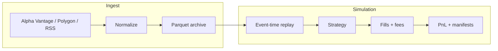

# crucibo

[](https://github.com/sweet-little-adder/crucibo/actions/workflows/ci.yml)

**Deterministic event-stream replay and simulation** for time-ordered market data.

Ingest real market bars from **Alpha Vantage** (free tier) → replay on an explicit event-time clock → score strategies with auditable run manifests.

---

## At a glance

| | |
|---|---|
| **Problem** | Backtests often cheat the clock, lose traceability, or can't be reproduced weeks later. |
| **Approach** | Typed tick/bar schema, sorted replay engine, explicit fill/fee model, Parquet outputs + JSON manifest per run. |
| **Data** | **Alpha Vantage** daily/intraday bars (free). Optional Polygon ticks (paid). Optional RSS news (free). |
| **Proof** | pytest + ruff; replay verified on real AAPL daily bars. |

```bash
git clone https://github.com/sweet-little-adder/crucibo.git && cd crucibo
python3 -m venv .venv && .venv/bin/pip install -e ".[dev]"
cp .env.example .env   # add ALPHA_VANTAGE_API_KEY
set -a && source .env && set +a
.venv/bin/crucibo alphavantage-daily --symbol AAPL
.venv/bin/crucibo replay-parquet \
  --ticks data/silver/alphavantage/symbol=AAPL/interval=daily/bars.parquet \
  --strategy buy_hold --target-shares 100 --fee-per-share 0 --slip-bps 5
```

Example output:

```json
{"equity_start": 999987.665, "equity_end": 1004880.665, "pnl_cash_approx": 4893.0}
```

---

## Pipeline



Details: [docs/ARCHITECTURE.md](docs/ARCHITECTURE.md)

---

## Features

- **Alpha Vantage ingest** — ~100 daily bars per symbol, one free API call (`alphavantage-daily`).
- **Event-time replay** — bars processed in causal order; no implicit lookahead.
- **Run manifests** — config, counts, paths, and summary KPIs bundled per experiment.
- **CLI tools** — `alphavantage-daily`, `replay-parquet`, `train-from-parquet`, optional Polygon/RSS.
- **Strategy model** — train a small MLP checkpoint and replay with `--strategy neural`.
- **Typed models** — pydantic schemas + Parquet roundtrips.

---

## Install

```bash
python3 -m venv .venv
.venv/bin/pip install -e ".[dev]"
```

Requires Python 3.11+.

---

## Commands

**Ingest real daily bars (free — 25 API calls/day):**

```bash
set -a && source .env && set +a
.venv/bin/crucibo alphavantage-daily --symbol AAPL
```

**Replay from Parquet:**

```bash
.venv/bin/crucibo replay-parquet \
  --ticks data/silver/alphavantage/symbol=AAPL/interval=daily/bars.parquet \
  --strategy buy_hold --target-shares 100
```

**Train MLP on real bars:**

```bash
.venv/bin/crucibo train-from-parquet \
  --ticks data/silver/alphavantage/symbol=AAPL/interval=daily/bars.parquet \
  --out models/aapl-daily.npz
```

**Quality gate:**

```bash
.venv/bin/pytest && .venv/bin/ruff check src tests
```

Outputs land under `./data/runs/<run_id>/` (override with `CRUCIBO_DATA_ROOT`).

---

## What this is / is not

- **Is:** Reproducible real-data slices, deterministic replay, walk-forward research scaffolding.
- **Is not:** HFT infra, live trading, or claims about market edge.

---

## Docs

| Doc | Purpose |
|-----|---------|
| [docs/ARCHITECTURE.md](docs/ARCHITECTURE.md) | Pipeline & components |
| [docs/VISION.md](docs/VISION.md) | North star & boundaries |
| [docs/ROADMAP.md](docs/ROADMAP.md) | Phases & remaining work |
| [docs/HANDOFF.md](docs/HANDOFF.md) | Operator commands & continuity |
| [docs/DATA.md](docs/DATA.md) | Schemas & vendor notes |

---

## Optional vendors

| Vendor | Cost | CLI |
|--------|------|-----|
| **Alpha Vantage** | Free (25 req/day) | `alphavantage-daily`, `alphavantage-intraday` |
| **Polygon** | ~$79/mo for ticks | `polygon-trades` |
| **RSS** | Free | `rss-ingest` |

See [docs/DATA.md](docs/DATA.md) and [docs/HANDOFF.md](docs/HANDOFF.md).

---

## Layout

```
crucibo/
  src/crucibo/     replay engine, ingest adapters, CLI
  tests/           pytest suite
  docs/            architecture, data contracts, roadmap
  experiments/     dated run notes
  models/          named .npz checkpoints
```

---

## License

MIT — see [LICENSE](LICENSE).
