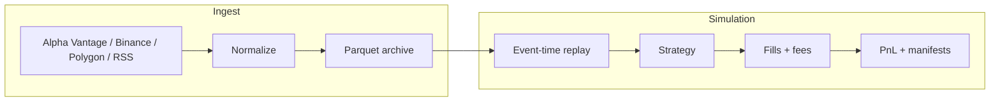

# crucibo

[](https://github.com/sweet-little-adder/crucibo/actions/workflows/ci.yml)

**Deterministic event-stream replay and simulation** for time-ordered market data.

Ingest real market bars from **Alpha Vantage** (free tier) → replay on an explicit event-time clock → score strategies with auditable run manifests.

---

## At a glance

| | |
|---|---|
| **Problem** | Backtests often cheat the clock, lose traceability, or can't be reproduced weeks later. |
| **Approach** | Typed tick/bar schema, sorted replay engine, explicit fill/fee model, Parquet outputs + JSON manifest per run. |
| **Data** | **Alpha Vantage** daily/intraday bars (free). **Binance** USD-M futures klines (free, no key). Optional Polygon ticks (paid). Optional RSS news (free). |
| **Proof** | pytest + ruff; replay verified on real AAPL daily bars. |

```bash
git clone https://github.com/sweet-little-adder/crucibo.git && cd crucibo
python3 -m venv .venv && .venv/bin/pip install -e ".[dev]"
cp .env.example .env   # add ALPHA_VANTAGE_API_KEY
set -a && source .env && set +a
.venv/bin/crucibo alphavantage-daily --symbol AAPL
.venv/bin/crucibo replay-parquet \
  --ticks data/silver/alphavantage/symbol=AAPL/interval=daily/bars.parquet \
  --strategy buy_hold --target-shares 100 --fee-per-share 0 --slip-bps 5
```

Example output:

```json
{"equity_start": 999987.665, "equity_end": 1004880.665, "pnl_cash_approx": 4893.0}
```

---

## Pipeline


```mermaid
flowchart LR
  subgraph ingest [Ingest]
    V[Alpha Vantage / Binance / Polygon / RSS] --> N[Normalize]
    N --> P[Parquet archive]
  end
  subgraph sim [Simulation]
    P --> R[Event-time replay]
    R --> S[Strategy]
    S --> F[Fills + fees]
    F --> O[PnL + manifests]
  end
```

Details: [docs/ARCHITECTURE.md](docs/ARCHITECTURE.md)

---

## Features

- **Alpha Vantage ingest** — ~100 daily bars per symbol, one free API call (`alphavantage-daily`).
- **Binance futures ingest** — USD-M perpetual klines, mark price, and funding rates (`ingest-binance`; no API key).
- **Event-time replay** — bars processed in causal order; no implicit lookahead.
- **Run manifests** — config, counts, paths, and summary KPIs bundled per experiment.
- **CLI tools** — full reference in [Commands](#commands) below (ingest, replay, train, news).
- **Strategy model** — train a small MLP checkpoint and replay with `--strategy neural`.
- **Typed models** — pydantic schemas + Parquet roundtrips.

---

## Install

```bash
python3 -m venv .venv
.venv/bin/pip install -e ".[dev]"
```

Requires Python 3.11+.

---

## Commands

All commands run as `crucibo <subcommand>`. Override data paths with `--data-root` or env `CRUCIBO_DATA_ROOT` (default: `./data`).

### Quick reference

| Command | Purpose | Auth |
|---------|---------|------|
| [`alphavantage-daily`](#alphavantage-daily) | US equity daily OHLCV bars (~100 days) | `ALPHA_VANTAGE_API_KEY` |
| [`alphavantage-intraday`](#alphavantage-intraday) | US equity intraday bars (~100 bars) | `ALPHA_VANTAGE_API_KEY` |
| [`ingest-binance`](#ingest-binance) | Binance USD-M perpetual klines + funding | None (public API) |
| [`polygon-trades`](#polygon-trades) | US equity tick trades for one UTC day | `POLYGON_API_KEY` (paid plan) |
| [`rss-feeds`](#rss-feeds) | List curated news feeds | None |
| [`rss-ingest`](#rss-ingest) | Ingest RSS headlines for one UTC day | None |
| [`replay-parquet`](#replay-parquet) | Event-time replay on a Parquet slice | None |
| [`train-from-parquet`](#train-from-parquet) | Train MLP checkpoint from Parquet bars | None |

---

### Ingest — market data

#### `alphavantage-daily`

Fetch ~100 **daily** OHLCV bars for a US equity symbol. One API call per run (free tier: 25 requests/day).

```bash
set -a && source .env && set +a
crucibo alphavantage-daily --symbol AAPL
```

| Flag | Required | Description |
|------|----------|-------------|
| `--symbol` | yes | Ticker, e.g. `AAPL` |
| `--data-root` | no | Override silver parent (default `data/`) |

**Output:** `data/silver/alphavantage/symbol=AAPL/interval=daily/bars.parquet` + `manifest.json`

---

#### `alphavantage-intraday`

Fetch ~100 **intraday** OHLCV bars (free tier is ~15-minute delayed).

```bash
crucibo alphavantage-intraday --symbol AAPL --interval 5min
crucibo alphavantage-intraday --symbol AAPL --interval 5min --date 2025-06-03
```

| Flag | Required | Default | Description |
|------|----------|---------|-------------|
| `--symbol` | yes | — | Ticker |
| `--interval` | no | `5min` | `1min`, `5min`, `15min`, `30min`, `60min` |
| `--date` | no | latest window | Filter to one UTC day `YYYY-MM-DD` |
| `--data-root` | no | `data/` | Override silver parent |

**Output:** `data/silver/alphavantage/symbol=AAPL/interval=5min/latest/bars.parquet` (or `date=YYYY-MM-DD/`)

---

#### `ingest-binance`

Download **Binance USD-M perpetual futures** klines from a start date through now (or `--end-date`). Also pulls mark-price klines and funding-rate history by default. No API key required.

```bash
crucibo ingest-binance --symbol BTCUSDT --interval 5m --start-date 2024-01-01
crucibo ingest-binance --symbol BTCUSDT --interval 5m --start-date 2024-01-01 --end-date 2024-06-01
crucibo ingest-binance --symbol BTCUSDT --interval 1h --start-date 2024-01-01 --no-mark-price
```

| Flag | Required | Default | Description |
|------|----------|---------|-------------|
| `--symbol` | yes | — | Perpetual pair, e.g. `BTCUSDT` |
| `--interval` | no | `5m` | Binance interval: `1m`, `3m`, `5m`, `15m`, `30m`, `1h`, `2h`, `4h`, `6h`, `8h`, `12h`, `1d`, `3d`, `1w`, `1M` |
| `--start-date` | yes | — | UTC start day `YYYY-MM-DD` (inclusive) |
| `--end-date` | no | now | UTC end day `YYYY-MM-DD` (inclusive) |
| `--no-mark-price` | no | off | Skip mark-price klines |
| `--no-funding` | no | off | Skip funding-rate history |
| `--data-root` | no | `data/` | Override silver parent |

**Output:** `data/silver/binance/symbol=BTCUSDT/interval=5m/start=2024-01-01/end=latest/bars.parquet` + `manifest.json`

Each row is a `TradeTick`: klines use `conditions=binance:futures-{interval}`, mark price uses `binance:mark-price-{interval}`, funding uses `binance:funding-rate` (rate stored in `price`).

---

#### `polygon-trades`

Fetch all **stock trades** for one symbol on one UTC calendar day. Requires a Polygon/Massive plan with historical trades entitlement (`403` = key OK, plan not).

```bash
set -a && source .env && set +a
crucibo polygon-trades --symbol AAPL --date 2025-06-03
```

| Flag | Required | Description |
|------|----------|-------------|
| `--symbol` | yes | Ticker |
| `--date` | yes | UTC day `YYYY-MM-DD` |
| `--data-root` | no | Override silver parent |

**Output:** `data/silver/polygon/symbol=AAPL/date=2025-06-03/trades.parquet` + `manifest.json`

---

### Ingest — news

#### `rss-feeds`

List curated free RSS/Atom feeds (no network call unless you ingest later).

```bash
crucibo rss-feeds
crucibo rss-feeds --json
```

| Flag | Description |
|------|-------------|
| `--json` | Machine-readable feed list |

---

#### `rss-ingest`

Ingest headlines for one UTC calendar day into Parquet. Use `--source` from `rss-feeds`, a custom `--feed-url`, or `--all` for every curated feed.

```bash
crucibo rss-ingest --source fed-press --date 2026-06-11
crucibo rss-ingest --all --date 2026-06-11
crucibo rss-ingest --feed-url https://example.com/feed.xml --source my-feed --date 2026-06-11
```

| Flag | Required | Description |
|------|----------|-------------|
| `--date` | yes | UTC day `YYYY-MM-DD` |
| `--source` | one of* | Feed id from `rss-feeds` |
| `--feed-url` | one of* | Custom feed URL |
| `--all` | one of* | Ingest every curated feed |
| `--data-root` | no | Override silver parent |

\* Provide exactly one of `--source`, `--feed-url`, or `--all`.

**Output:** `data/silver/news/source=fed-press/date=2026-06-11/articles.parquet` + `manifest.json`

---

### Simulation

#### `replay-parquet`

Replay a Parquet slice (`bars.parquet` or `trades.parquet`) in **event-time order**. Writes fills, equity curve, and a run manifest under `data/runs/<run_id>/`.

```bash
crucibo replay-parquet \
  --ticks data/silver/alphavantage/symbol=AAPL/interval=daily/bars.parquet \
  --strategy buy_hold --target-shares 100

crucibo replay-parquet \
  --ticks data/silver/binance/symbol=BTCUSDT/interval=5m/start=2024-01-01/end=latest/bars.parquet \
  --strategy buy_hold --target-shares 1 --fee-per-share 0 --slip-bps 5

crucibo replay-parquet \
  --ticks data/silver/alphavantage/symbol=AAPL/interval=daily/bars.parquet \
  --strategy neural --model models/aapl-daily.npz
```

| Flag | Default | Description |
|------|---------|-------------|
| `--ticks` | — | Input Parquet path (required) |
| `--strategy` | `flat` | `flat` \| `buy_hold` \| `neural` |
| `--target-shares` | `100` | Shares for `buy_hold` / `neural` |
| `--model` | — | `.npz` checkpoint (required for `neural`) |
| `--slip-bps` | `2.0` | Symmetric slippage in basis points |
| `--fee-per-share` | `0.005` | Per-share fee |
| `--initial-cash` | `1000000` | Starting cash |
| `--run-id` | auto | Override run directory name |
| `--data-root` | `data/` | Runs parent override |

**Output:** `data/runs/<run_id>/` (manifest, fills, equity curve)

---

#### `train-from-parquet`

Train a small MLP on bar/tick Parquet and save a `.npz` checkpoint for `--strategy neural`.

```bash
crucibo train-from-parquet \
  --ticks data/silver/alphavantage/symbol=AAPL/interval=daily/bars.parquet \
  --out models/aapl-daily.npz
```

| Flag | Default | Description |
|------|---------|-------------|
| `--ticks` | — | Input Parquet (required) |
| `--out` | — | Output `.npz` path (required) |
| `--seed` | `42` | Random seed |
| `--lookback` | `20` | Feature window (bars) |
| `--forward-horizon` | `5` | Label horizon (bars) |
| `--hidden-dim` | `8` | MLP hidden size |
| `--epochs` | `80` | Training epochs |
| `--learning-rate` | `0.05` | SGD learning rate |
| `--threshold` | `0.5` | Buy/sell probability threshold |
| `--target-shares` | `50` | Shares when signal fires |
| `--initial-cash` | `1000000` | Cash for in-sample scoring |

---

### Development

**Quality gate:**

```bash
pytest && ruff check src tests
```

---

### Environment variables

| Variable | Used by |
|----------|---------|
| `ALPHA_VANTAGE_API_KEY` | `alphavantage-daily`, `alphavantage-intraday` |
| `POLYGON_API_KEY` | `polygon-trades` |
| `CRUCIBO_DATA_ROOT` | All ingest/replay commands (default `data/`) |
| `CRUCIBO_GIT_SHA` | Optional git SHA stamped into manifests |

Copy `.env.example` → `.env` and `set -a && source .env && set +a` before running keyed commands.

---

## What this is / is not

- **Is:** Reproducible real-data slices, deterministic replay, walk-forward research scaffolding.
- **Is not:** HFT infra, live trading, or claims about market edge.

---

## Docs

| Doc | Purpose |
|-----|---------|
| [docs/ARCHITECTURE.md](docs/ARCHITECTURE.md) | Pipeline & components |
| [docs/VISION.md](docs/VISION.md) | North star & boundaries |
| [docs/ROADMAP.md](docs/ROADMAP.md) | Phases & remaining work |
| [docs/HANDOFF.md](docs/HANDOFF.md) | Operator commands & continuity |
| [docs/DATA.md](docs/DATA.md) | Schemas & vendor notes |

---

## Optional vendors

| Vendor | Cost | Commands |
|--------|------|----------|
| **Alpha Vantage** | Free (25 req/day) | `alphavantage-daily`, `alphavantage-intraday` |
| **Binance** | Free (public API) | `ingest-binance` |
| **Polygon** | ~$79/mo for ticks | `polygon-trades` |
| **RSS** | Free | `rss-feeds`, `rss-ingest` |

See [Commands](#commands) above and [docs/DATA.md](docs/DATA.md).

---

## Layout

```
crucibo/
  src/crucibo/     replay engine, ingest adapters, CLI
  tests/           pytest suite
  docs/            architecture, data contracts, roadmap
  experiments/     dated run notes
  models/          named .npz checkpoints
```

---

## License

MIT — see [LICENSE](LICENSE).
