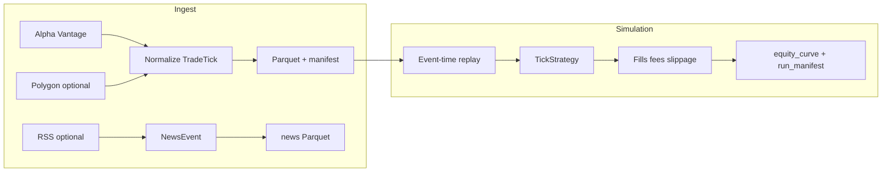

# Architecture

## Pipeline



## Components

| Module | Role |
|--------|------|
| `crucibo.alphavantage` | Free daily/intraday OHLCV → `TradeTick` silver slices |
| `crucibo.polygon` | Optional paid tick ingest |
| `crucibo.news` | Free RSS headlines → `NewsEvent` silver slices |
| `crucibo.models` | Versioned pydantic rows |
| `crucibo.io_parquet` | Polars read/write |
| `crucibo.replay.engine` | Deterministic sort + naive fills |
| `crucibo.replay.strategies` | `flat`, `buy_hold`, `neural` |
| `crucibo.mlp` | Small MLP train/save/load |
| `crucibo.cli` | Batch entrypoints |

## Replay contract

- Input: `list[TradeTick]` sorted by `(ts_event_ns, symbol)`.
- Strategy: `desired_shares(tick, index, n_ticks, position, cash) -> int`.
- Output: fills list, equity curve, final cash/shares.
- Economics: `ReplayConfig(slip_bps, fee_per_share, initial_cash)`.

## Storage

```
data/silver/alphavantage/symbol=AAPL/interval=daily/bars.parquet
data/silver/polygon/symbol=AAPL/date=YYYY-MM-DD/trades.parquet
data/silver/news/source=fed-press/date=YYYY-MM-DD/articles.parquet
data/runs/<run_id>/
```

## Manifests

Every ingest writes `manifest.json` (vendor, row count, SHA-256, fetch time).  
Every replay writes `run_manifest.json` (strategy, tick file, PnL summary, git SHA if set).

## Non-goals (today)

- WebSocket streaming
- Order book / NBBO
- Live broker integration

See [DATA.md](DATA.md) for schema fields and vendor notes.
