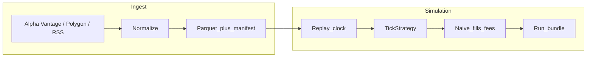

# Crucibo — existing plan and full scope

## Existing plan (where it lives)

The **canonical project plan** is the docs tree:

| Document | Role |
|----------|------|
| [docs/HANDOFF.md](HANDOFF.md) | **Start here** — Alpha Vantage workflow, commands |
| [docs/ROADMAP.md](ROADMAP.md) | Phased checklist, done vs unchecked |
| [docs/VISION.md](VISION.md) | North star, non-goals, outcomes |
| [docs/ARCHITECTURE.md](ARCHITECTURE.md) | Pipeline diagram and component boundaries |
| [docs/DECISIONS.md](DECISIONS.md) | ADRs (Python-first, Alpha Vantage default, optional Polygon) |

**Current snapshot:** Alpha Vantage daily ingest + replay on real AAPL bars **works on free tier**.

---

## What crucibo is

**Tagline:** US-equities research sandbox — real market data ingest, event-time replay, auditable run manifests.

**Core thesis** ([docs/VISION.md](VISION.md)): professional systematic habits (time, leakage, fills, fees, auditability) on a limited-scope pipeline.

**Pipeline:**



**Success criterion:** If you cannot reproduce last month’s experiment on Tuesday, it did not happen.

---

## Implemented today

| Module | Path | Role |
|--------|------|------|
| **Alpha Vantage** | `src/crucibo/alphavantage/` | Free daily/intraday bars → Parquet |
| **Polygon** | `src/crucibo/polygon/` | Optional paid tick ingest |
| **News RSS** | `src/crucibo/news/` | Free headline ingest |
| **Replay** | `src/crucibo/replay/` | Event-time engine + strategies |
| **MLP** | `src/crucibo/mlp.py` | Train/load small neural checkpoints |
| **CLI** | `src/crucibo/cli.py` | `alphavantage-daily`, `replay-parquet`, `train-from-parquet`, … |

```bash
# Primary path — real data
crucibo alphavantage-daily --symbol AAPL
crucibo replay-parquet --ticks data/silver/alphavantage/symbol=AAPL/interval=daily/bars.parquet --strategy buy_hold
```

---

## Tests

pytest covers: models, parquet I/O, Alpha Vantage mapper, Polygon mapper, replay engine, MLP train/load, RSS mapper.

---

## Next priorities

- [ ] Walk-forward CLI (train/OOS date split on Alpha Vantage parquet)
- [ ] Session clock for intraday bars
- [ ] News + replay merge by event time

See [docs/ROADMAP.md](ROADMAP.md).
